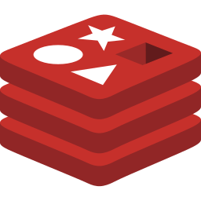

<h1 align="center">Hi there , I'm Rohan</h1>
<h3 align="center">An Enthusiastic Developer</h3>

  

### Connect with me
<a href="https://www.linkedin.com/in/rohanpandeyy/"><picture></picture></a>&nbsp;&nbsp;
<a href="http://instagram.com/wtf_ronn/"><picture></picture></a>&nbsp;&nbsp;
<a href="mailto:rohan1706pandey@gmail.com"><picture></picture></a>&nbsp;&nbsp;
<a href="https://rohan-pandeyy.github.io"><picture></picture></a>&nbsp;&nbsp;
<a href="https://github.com/rohan-pandeyy/"><picture><source media="(prefers-color-scheme: dark)" srcset="./public/social-media/github-dark.svg"><source media="(prefers-color-scheme: light)" srcset="./public/social-media/github-light.svg"></picture></a>&nbsp;&nbsp;
<a href="https://x.com/rohan_pandeyy/"><picture><source media="(prefers-color-scheme: dark)" srcset="./public/social-media/x-dark.svg"><source media="(prefers-color-scheme: light)" srcset="./public/social-media/x-light.svg"></picture></a>&nbsp;&nbsp;
<a href="https://leetcode.com/u/rohan-pandeyy/"><picture><source media="(prefers-color-scheme: dark)" srcset="./public/social-media/leetcode-dark.svg"><source media="(prefers-color-scheme: light)" srcset="./public/social-media/leetcode-light.svg"></picture></a>&nbsp;&nbsp;

<!--- I’m currently learning ****.-->
## Talking about Personal Stuffs:

- 🌱 I’m currently learning **Generative AI**.
- 🔭 I’m currently working on a **Defogging & Deraining using Computer Visions**.
- 🏠 I’m currently moderating the **[Data Science Society](https://github.com/dss-bu)**
- 👯 I’m looking to collaborate on **IOT, CV, LLM, Web & App devs**.
- 🤔 I’m looking for help with **Optimizing a CNN.**.
- 📫 How to reach me: **rohan1706pandey@gmail.com**

##
### Highlights

> - Worked with folks @[KeenHeads](https://keenheads.com/)
> - Worked with folks @TheDesignNetwork
> - I love to learn in public. [Check it out](https://x.com/rohan_pandeyy/)

### 🌐About Me
I craft digital experiences with NextJS and bring them to life with Tailwind & NodeJS. Additionally, I love building AI powered machines and robots that help ease out daily lives. Beyond code, I lead and thrive in the tech community, the *Data Science Society*, sharing knowledge and innovating together. Play guitar, drums, and piano. If this sparks your interest, let's connect and explore how we can create something amazing together!

  

<h2 align="left">🛠️ Languages and Tools </h2>

<picture></picture>
<picture></picture>
<picture></picture>
<picture></picture>
<picture></picture>
<picture></picture>
<picture><source media="(prefers-color-scheme: dark)" srcset="./public/languages-and-tools/nextjs-dark.svg"><source media="(prefers-color-scheme: light)" srcset="./public/languages-and-tools/nextjs-light.svg"></picture>
<picture></picture>
<picture><source media="(prefers-color-scheme: dark)" srcset="./public/languages-and-tools/expressjs-dark.svg"><source media="(prefers-color-scheme: light)" srcset="./public/languages-and-tools/expressjs-light.svg"></picture>
<picture></picture>
<picture></picture>
<picture><source media="(prefers-color-scheme: dark)" srcset="./public/languages-and-tools/shadcnui-dark.svg"><source media="(prefers-color-scheme: light)" srcset="./public/languages-and-tools/shadcnui-light.svg"></picture>
<picture></picture>
<picture><source media="(prefers-color-scheme: dark)" srcset="./public/languages-and-tools/postgresql-dark.svg"><source media="(prefers-color-scheme: light)" srcset="./public/languages-and-tools/postgresql-light.svg"></picture>
<picture></picture>
<picture></picture>
<picture></picture>
<picture></picture>
<picture><source media="(prefers-color-scheme: dark)" srcset="./public/languages-and-tools/github-dark.svg"><source media="(prefers-color-scheme: light)" srcset="./public/languages-and-tools/github-light.svg"></picture>
<picture></picture>
<picture></picture>
<picture></picture>
<picture><source media="(prefers-color-scheme: dark)" srcset="./public/languages-and-tools/linux-dark.svg"><source media="(prefers-color-scheme: light)" srcset="./public/languages-and-tools/linux-light.svg"></picture>
<picture><source media="(prefers-color-scheme: dark)" srcset="./public/languages-and-tools/bash-dark.svg"><source media="(prefers-color-scheme: light)" srcset="./public/languages-and-tools/bash-light.svg"></picture>
<picture></picture>
<picture><source media="(prefers-color-scheme: dark)" srcset="./public/languages-and-tools/aws-dark.svg"><source media="(prefers-color-scheme: light)" srcset="./public/languages-and-tools/aws-light.svg"></picture>
<picture></picture>
<picture><source media="(prefers-color-scheme: dark)" srcset="./public/languages-and-tools/vercel-dark.svg"><source media="(prefers-color-scheme: light)" srcset="./public/languages-and-tools/vercel-light.svg"></picture>

<!-- 
                              -->

##

  

<picture><source media="(prefers-color-scheme: dark)" srcset="https://raw.githubusercontent.com/rohan-pandeyy/rohan-pandeyy/output/github-snake-dark.svg"><source media="(prefers-color-scheme: light)" srcset="https://raw.githubusercontent.com/rohan-pandeyy/rohan-pandeyy/output/github-snake.svg"></picture>

